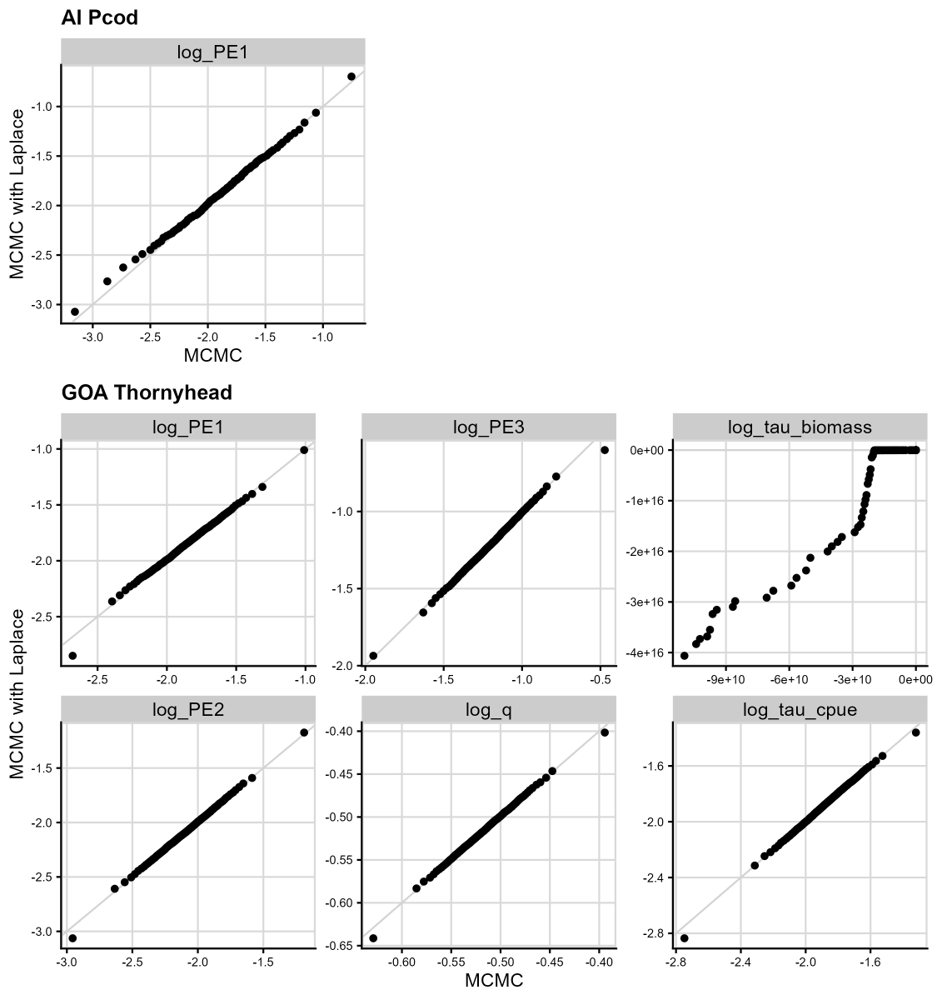

```{r, include=FALSE, echo=FALSE, results='hide', fig.keep='all'}

knitr::opts_chunk$set(
  collapse = TRUE,
  comment = "#>"
)
rema_path <- find.package("rema")
knitr::opts_knit$set(root.dir = file.path(rema_path, "example_data"))
knitr::opts_chunk$set(warning = FALSE, message = FALSE)

# devtools::build_rmd(files = 'vignettes/ex4_model_validation.Rmd')
# pkgdown::build_site()

```

```{r setup, warning = FALSE, message = FALSE, echo=FALSE,results='hide',fig.keep='all'}
library(ggplot2)
library(dplyr)
library(tidyr)
# Packages for MCMC and diagnostics
library(tmbstan)
# tmbstan relies on rstan, which now needs to be installed through the R
# universe. if you are experiencing errors with MCMC, try uninstalling and then
# re-installing rstan using this code chunk (also don"t forget to restart your
# computer so that your path resets)
# install.packages("rstan", repos = c("https://stan-dev.r-universe.dev",
#                                     "https://cloud.r-project.org"))
library(rstan)
library(bayesplot)
# install.packages("devtools")
# devtools::install_github("afsc-assessments/rema")
library(rema)

ggplot2::theme_set(cowplot::theme_cowplot(font_size = 11) + cowplot::background_grid() + cowplot::panel_border())
```

### Motivation

-   Fisheries stock assessments are moving towards state-space estimation, which boasts a range of benefits, including separation and estimation of observation and process error, a more elegant framework for handling missing data, a high degree of flexibility with respect to model architecture and inclusion of different data types, and the potential for improved projections and predictive skill (needs citations).

-   The flexibility and relative ease of fitting state-space models means they can increase in complexity and dimensionality rapidly. While easy to fit, state-space models are often challenging to validate and even simple models can suffer from estimation issues (Auger‐Méthé et al., 2016).

-   At the North Pacific Fishery Management Council, the "random effects model" (REMA) used for Tier 5 groundfish stock assessments, Tier 4 crab stock assessments, and apportionment for many stocks, is by far the most common state-space model used for fishery management. Despite the high impact of this model, we have no standard model validation practices for REMA.

-   The goals of this study are to provide several examples of common state-space model validation techniques applied to real life REMA models and to make preliminary recommendations for model validation of REMA and other state-space models within our management framework.

### A testing framework for REMA model validation

In this vignette, we will be testing that (1) REMA is working as expected (i.e., code has been implemented correctly and parameters are estimated without bias), and (2) that the assumptions made when parameterizing and estimating REMA are valid, including assumptions related to random effects and error structure. We use two example stocks with varying levels of complexity:

-   Aleutian Islands Pacific cod (AI Pcod; Spies et al., 2023): a simple, univariate case, which fits to a single time series of the AI bottom trawl survey and estimates one process error

-   Gulf of Alaska Thornyhead rockfish (GOA thornyhead; Echave et al., 2022): a complex, multi-strata and multi-survey case, which estimates multiple process errors, a scaling parameter for the longline survey, and two additional observation errors for the GOA bottom trawl and longline surveys

Testing REMA across this range of complexity helps ensure that model and model assumptions are valid in a variety of realistic, management-relevant cases.

It is important to note that model validation does not mean the model is "more right" or "more correct." Model validation does not help an analyst with model selection, except to identify models which are not functioning properly, nor does it ensure that the model makes "better" predictions. Rather, model validation is a way to ensure that the model is operating as expected, without introducing bias or violating statistical assumptions upon which the model is based (Auger‐Méthé et al., 2016; Auger‐Méthé et al., 2021).

The key questions we aim to answer are:

-   Does the model perform as expected, or does it introduce bias? Using a simulation self-check, we will test if the model is coded correctly and is able to recover known parameters.
-   Is it plausible that our data could have been generated by the model? Using one-step ahead (OSA) residuals, the appropriate residual type for state-space models, we test the model assumptions and look for trends in residuals that may reveal characteristics or dynamics of the data that aren't adequately captured by the model.
-   Are the normality assumptions made when estimating random effects via the Laplace approximation valid? By comparing a non-Laplace approximation and a Laplace approximation of the model via MCMC, we test if the distribution of the fixed effects parameters' posteriors are normal or normal-like.
-   Are the parameters unique and non-redundant? Checking the correlation between parameters helps us identify if parameters are redundant with each other.

### Prepare data for each stock here

First, we run the model for each stock. The AI Pcod model (pcod_mod) uses a single process error to describe the stock over time (one parameter). The GOA thornyhead rockfish model (thrn_mod) uses three process errors and data from two surveys (bottom trawl and longline survey) to describe the stock over time (six parameters; three sur).

```{r data and model prep, fig.keep='all', message=FALSE, warning=FALSE}

set.seed(415) # for reproducibility, use a seed

# first, get the p-cod data set up
pcod_bio_dat <- read.csv("ai_pcod_2022_biomass_dat.csv")
pcod_input <- prepare_rema_input(model_name = "p_cod",
                                 biomass_dat = pcod_bio_dat,
                                 # one strata
                                 PE_options = list(pointer_PE_biomass = 1)
                                 )
# run the model
pcod_mod <- fit_rema(pcod_input) 

# next, get the thornyhead data set up
thrn_bio_dat <- read.csv("goa_thornyhead_2022_biomass_dat.csv")
thrn_cpue_dat <-read.csv("goa_thornyhead_2022_cpue_dat.csv")
thrn_input <- prepare_rema_input(model_name = 'thrnhead_rockfish',
                                multi_survey = TRUE,
                                biomass_dat = thrn_bio_dat,
                                cpue_dat = thrn_cpue_dat,
                                # RPWs are a summable/area-weighted effort index
                                sum_cpue_index = TRUE, 
                                # three process error parameters (log_PE) estimated,
                                # indexed as follows for each biomass survey stratum
                                # (shared within an area across depths):
                                PE_options = list(pointer_PE_biomass = c(1, 1, 1, 2, 2, 2, 3, 3, 3)),
                                # scaling parameter options:
                                q_options = list(
                                # longline survey strata (n=3) indexed as follows for the
                                # biomass strata (n=9)
                                pointer_biomass_cpue_strata = c(1, 1, 1, 2, 2, 2, 3, 3, 3),
                                # one scaling parameters (log_q) estimated, shared
                                # over all three LLS strata
                                pointer_q_cpue = c(1, 1, 1)),
                                # estimate extra trawl survey observation error
                                extra_biomass_cv = list(assumption = 'extra_cv'),
                                # estimate extra longline survey observation error
                                extra_cpue_cv = list(assumption = 'extra_cv')
                                )

# run the model
thrn_mod <- fit_rema(thrn_input) 

# tidy output and plot fitted data
tidy_pcod <- tidy_rema(pcod_mod)
p1 <- plot_rema(tidy_pcod)$biomass_by_strata + 
  ggtitle(label = "Model Fits to the AI Pcod Data",
          subtitle = "Trawl Survey Biomass Strata") + 
  geom_ribbon(aes(ymin = pred_lci, ymax = pred_uci),
              col = 'goldenrod', fill = 'goldenrod', alpha = 0.4) +
  geom_line() +
  geom_point(aes(x = year, y = obs)) +
  geom_errorbar(aes(x = year, ymin = obs_lci, ymax = obs_uci))
p1
ggsave(paste0("vignettes/ex4_pcod_fits.png"), width = 6, height = 4, units = "in", bg = "white")

tidy_thrn <- tidy_rema(thrn_mod)
p2 <- plot_rema(tidy_thrn, biomass_ylab = 'Biomass (t)')$biomass_by_strata + 
  ggtitle(label = "Model Fits to the GOA Thornyhead Data",
          subtitle = "Trawl Survey Biomass Strata") + 
  geom_ribbon(aes(ymin = pred_lci, ymax = pred_uci),
              col = "#21918c", fill = "#21918c", alpha = 0.4) +
  geom_line() +
  geom_point(aes(x = year, y = obs)) +
  geom_errorbar(aes(x = year, ymin = obs_lci, ymax = obs_uci))
p2
p3 <- plot_rema(tidy_thrn, cpue_ylab = "RPW")$cpue_by_strata + 
  ggtitle(label = NULL, subtitle = "Longline Survey Relative Population Weight (RPW) Strata") + 
  geom_ribbon(aes(ymin = pred_lci, ymax = pred_uci),
              col = "#21918c", fill = "#21918c", alpha = 0.4) +
  geom_line() +
  geom_point(aes(x = year, y = obs)) +
  geom_errorbar(aes(x = year, ymin = obs_lci, ymax = obs_uci))
p3
cowplot::plot_grid(p2, p3, rel_heights = c(0.7, 0.3), ncol = 1)
ggsave(paste0("vignettes/ex4_thrn_fits.png"), width = 11, height = 10, units = "in", bg = "white")

```

{width="10in"}

### 1. Simulation self-test: Can we recover parameters without bias?

Simulation testing is an important step to ensure the model has been properly coded and performs consistently without introducing bias (Auger‐Méthé et al., 2021; Gimenez et al., 2004). First, we use the REMA model to estimate parameters (e.g., process error variance) from the real data in the AI Pcod and GOA Thornyhead case studies. Next, we use the estimated parameters as "true" values to simulate new data (simulated observations and states) using the REMA equations. For AI Pcod each simulated data set is a biomass trajectory, and for GOA Thornyhead it includes biomass trajectories in nine strata and longline survey relative population weights (RPWs) in three strata. We use the REMA model to re-estimate the model parameters and calculate the relative error (RE; i.e., (true-estimated values)/true value\*100)) for the parameters in each simulation replicate (N=500).

Models fail this simulation testing when the recovered parameters are biased, or deviate consistently from the true values used to simulate data. If the recovered parameters are far from the true values or the span of the recovered parameters is large, this may indicate that the model has a coding, is non-identifiable, has redundant parameters, or is bias (i.e., there is some other kind of model misspecification).

The following function runs a simulation self-test for a REMA model.

```{r simulation testing function, eval=FALSE, message=FALSE, warning=FALSE}

sim_test <- function(mod_name, replicates, cpue) {

  # storage things
  re_est <- matrix(NA, replicates, length(mod_name$par)) # parameter estimates

  # go through the model
  suppressMessages(for(i in 1:replicates) {

    sim <- mod_name$simulate(complete = TRUE) # simulates the data

    # simulated biomass observations:
    tmp_biomass <- matrix(data = exp(sim$log_biomass_obs), ncol = ncol(mod_name$input$data$biomass_obs))
    colnames(tmp_biomass) <- colnames(mod_name$data$biomass_obs)
    # simulated cpue observations, when applicable:
    if (cpue) {tmp_cpue <- matrix(data = sim$cpue_obs, ncol = ncol(mod_name$input$data$cpue_obs))
    colnames(tmp_cpue) <- colnames(mod_name$data$cpue_obs)}
    # set up new data for input
    newinput <- mod_name$input
    newinput$data$biomass_obs <- tmp_biomass # biomass data
    if (cpue) {newinput$data$cpue_obs <- tmp_cpue} # cpue data

    # create "obsvec" which is used internally in cpp file as the observation
    # vector for all observation (log biomass + cpue) in the likelihood
    # functions (and required for OSA residuals). note the transpose t() needed
    # to get these matrices in the correct order (by row instead of by col) --
    # note obsvec is masked from users normally in prepare_rema_input()
    newinput$data$obsvec <- t(sim$log_biomass_obs)[!is.na(t(sim$log_biomass_obs))]
    if (cpue) {newinput$data$obsvec <- c(t(sim$log_biomass_obs)[!is.na(t(sim$log_biomass_obs))], t(sim$log_cpue_obs)[!is.na(t(sim$log_cpue_obs))])}

    # refit model
    mod_new <- fit_rema(newinput, do.sdrep = FALSE)

    # add parameter estimates to matrix
    if(mod_new$opt$convergence == 0) {
      re_est[i, ] <- mod_new$env$last.par[1:length(mod_name$par)]
    } else {
      re_est[i, ] <- rep(NA, length(mod_name$par))
    }

  })

  re_est <- as.data.frame(re_est); re_est$type <- rep("recovered")

  return(re_est)

}
```

Run self-test for AI Pcod and GOA Thornyhead and examine results.

```{r run simulation self-test, eval=FALSE, message=FALSE, warning=FALSE}

# run for pcod and prep data frame
# run simulation testing
par_ests <- sim_test(mod_name = pcod_mod, replicates = 500, cpue = FALSE)
# get data frame with simulation values for each parameter
n_not_converged_pcod <- length(which(is.na(par_ests[,1]))); n_pcod <- length(par_ests[,1])
prop_converged_pcod <- 1-n_not_converged_pcod/n_pcod

mod_par_ests <- data.frame("log_PE1" = pcod_mod$env$last.par[1],
                           type = "model")
names(par_ests) <- names(mod_par_ests) # rename for ease
pcod_par_ests <- rbind(mod_par_ests, par_ests) # recovered and model in one data frame
pcod_par_ests$sp <- rep("AI Pcod")

# run for thorny and prep data frame -- same process
# run simulation testing
par_ests <- sim_test(mod_name = thrn_mod, replicates = 500, cpue = TRUE) # note some warnings
# sometimes spits out: In stats::nlminb(model$par, model$fn, model$gr, control =
# list(iter.max = 1000,...: NA/NaN function evaluation
n_not_converged_thrn <- length(which(is.na(par_ests[,1]))); n_thrn <- length(par_ests[,1])
prop_converged_thrn <- 1-n_not_converged_thrn/n_thrn
nrow(par_ests)
# get data frame with simulation values for each parameter
mod_par_ests <- data.frame("log_PE1" = thrn_mod$env$last.par[1],
                           "log_PE2" = thrn_mod$env$last.par[2],
                           "log_PE3" = thrn_mod$env$last.par[3],
                           "log_q" = thrn_mod$env$last.par[4],
                           "log_tau_biomass" = thrn_mod$env$last.par[5],
                           "log_tau_cpue" = thrn_mod$env$last.par[6],
                           type = "model")
names(par_ests) <- names(mod_par_ests) # rename for ease
thrn_par_ests <- rbind(mod_par_ests, par_ests) # recovered and model parameters in one data frame
thrn_par_ests$sp <- rep("GOA Thornyhead")

# reogranize data
pcod_sim <- pcod_par_ests %>% pivot_longer(1, names_to = "parameter")
thrn_sim <- thrn_par_ests %>% pivot_longer(1:6, names_to = "parameter")
sim_dat <- rbind(pcod_sim, thrn_sim)

# Relative Error: ((om-em)/om)
sim_re <- sim_dat %>%
  pivot_wider(id_cols = c("sp", "parameter"),
              names_from = type, values_from = value) %>%
  unnest(cols = c(model, recovered)) %>%
  mutate(RE = (model-recovered)/model*100) %>%
  group_by(sp, parameter) %>%
  mutate(label = paste0("Median RE=", formatC(median(RE, na.rm = TRUE), format = "f", digits = 1), "%")) %>%
  suppressWarnings()

# plot distribution of simulated parameter estimates
plot_sim <- function(sim_dat, plot_title, fill_col = "#21918c") {
  ggplot(NULL, aes(parameter, value)) +
    # add distribution of recovered parameters
    geom_violin(data = sim_dat %>% filter(type == "recovered"),
                fill = fill_col, alpha = 0.6, draw_quantiles = 0.5) +
    # add "true values" from original model
    geom_point(data = sim_dat %>% filter(type == "model"),
               size = 2, col = "black") +
    facet_wrap(~ parameter, scales = "free", nrow = 1) +
    labs(x = NULL, y = "Parameter estimate", title = plot_title,
         subtitle = "Distribution of parameters estimates (median=horizontal line, true value=point)") +
    scale_x_discrete(labels = NULL, breaks = NULL)
}
# plot relative error
plot_re <- function(sim_re, fill_col = "#21918c") {
  ggplot(NULL, aes(parameter, RE)) +
    # add distribution of recovered parameters
    geom_boxplot(data = sim_re, alpha = 0.6, fill = fill_col,
                 na.rm = TRUE, outlier.size = 0.8) +
    geom_hline(yintercept = 0) +
    # separate by parameter
    facet_wrap(~ parameter+label, scales = "free", nrow = 1) + #, space = "free") +
    labs(x = NULL, y = "Relative error (%)", subtitle = "Distribution of relative error (RE; i.e., (true-estimated values)/true value*100)") +
    scale_x_discrete(labels = NULL, breaks = NULL)
}

p1pcod <- plot_sim(pcod_sim, "AI Pcod Simulation", fill_col = "goldenrod")
p1thrn <- plot_sim(thrn_sim, "GOA Thornyhead Simulation")

p2pcod <- plot_re(sim_re %>% filter(sp == "AI Pcod"), fill_col = "goldenrod")
p2thrn <- plot_re(sim_re %>% filter(sp == "GOA Thornyhead"))

cowplot::plot_grid(p1pcod, p2pcod, ncol = 1)
ggsave(paste0("vignettes/ex4_sim_pcod.png"), width = 6.5, height = 7, units = "in", bg = "white")

cowplot::plot_grid(p1thrn, p2thrn, ncol = 1)
ggsave(paste0("vignettes/ex4_sim_thrn.png"), width = 11, height = 7, units = "in", bg = "white")

```

**Results of the simulation self-test**

Only 1 out of 500 simulation replicates did not converge for the AI Pcod model, which suggests a high degree of model stability. There were 11 out 500 simulation replicates for the GOA Thornyhead model that did not converge. In the following figures the top panel shows the distribution of resulting parameter estimates for the parameter estimates in each of the models based on the simulations, where the horizontal line is the median estimated value and the black dot is the "true" value (i.e., the parameters estimates from the real data sets). As demonstrated in the boxplots of the bottom panels in the figures below, the parameters in both models are recovered well in simulation testing, with low median relative error. In both models there are instances of long negative tails in the log standard deviation of the process error (log_PE), suggesting that PE was small or tended towards zero in some simulations. This is also the case for the extra observation error for the biomass survey (log_tau_biomass) in the GOA Thornyhead model. These outlier replicates may shed light on why some replicates failed to converge. Specifically, `nlminb`, the optimizer used by `rema`, returned a "`NA/NaN function evaluation`" error, which commonly means the optimizer got "stuck" in a parameter space that is incompatible with the assumptions of the model; e.g., PE wanted to be zero but couldn't because PE is log-transformed. The negative log-scale values are most extreme for the GOA Thornyhead model, which should raise some concern of potential model mispecification or over-parameterization. For example, given the trade off between between process and observation error in REMA, it is possible that the estimation of additional observation error on the biomass survey may not be justified (a PE=0 is the same as taking a global mean of the biomass time series).

<!-- {width="6in"} -->
{width="6in"}

<!-- {width="10in"} -->
{width="10in"}

### 2. Residual analysis

Residuals are used to test the underlying assumptions about the error distributions in the model. For example, in a linear regression, residuals should be independent, normal, and have constant variance. Traditional residuals (e.g., Pearson's residuals) are inappropriate for state-space models like REMA, because process error variance may be over-estimated in cases where the model is mis-specified, thus leading to artificially small residuals (see Section 3 of Thygesen et al. 2017 for an example). The appropriate residual type for validation of state-space models are called one-step ahead (OSA) residuals. Instead of comparing the observed and expected values at the same time step, OSA residuals use forecasted values based on all previous observations (i.e., they exclude the observed value at the current time step from prediction). In this way, OSA residuals account for non-normality and correlation among years. Under a correctly specified model, resultant OSA residuals should be independent and identically distributed (i.i.d.) with a standard normal distribution $N(0,1)$.

Methods for calculating OSA residuals in REMA have been implemented in the `rema::get_osa_residuals()` using the `TMB::oneStepPredict()` function and the `fullGaussian` method. The `rema::get_osa_residuals()` returns tidied dataframes of observations, REMA model predictions, and OSA residuals for the biomass and CPUE survey data when appropriate, along with several diagnostic plots.

One useful diagnostic plot provided in the output to `rema::get_osa_residuals()` is the normal quantile-quantile (QQ) plot, which can help users determine if the OSA residuals are likely to have come from the expected standard normal distribution. In a normal QQ plot, the quantile values of the standard normal distribution are plotted on the x-axis, and the corresponding quantile values of the OSA residuals are plotted on the y-axis. If the OSA residuals are normally distributed, the points will fall on the 0/1 reference line. If the residuals are not normally distributed, the points will deviate from the reference line. OSA residuals are plotted for the entire data set combined `$plots$qq` and by stratum for the biomass survey `$plots$biomass_qq` or CPUE survey `$plots$cpue_qq`. While it can be useful to check for residual patterns by stratum, users should be aware that small sample sizes may not have statistical power. In the top-left corner of the combined QQ plot `$plots$qq`, we provide the standard deviation of normalized residuals (SDNR) statistic. Given that OSA residuals should be $N(0,1)$ under a correctly specified model, we should expect the SDNR to be equal to close to 1.

In addition to the normal QQ plots, we examine visual fits of the OSA residuals by year in order to test for randomness or independence of the residuals (i.e., they should not be correlated by year). Standard approaches such as autocorrelation function (ACF) plots or residual runs tests (e.g., Wald-Wolfowitz test) are inappropriate for many REMA applications because of missing years of data in the survey time series. Patterns in the residuals may indicate structure in the data (i.e., temporal correlation) that is not adequately captured by the model. These figures are also useful for identifying outliers. Under the assumed standard normal distribution, a residual is considered an outlier when it is greater than 3 or less than -3.

The following code shows how to run an OSA residual analysis for AI Pcod and GOA Thornyhead REMA models.

```{r run osa, eval=FALSE, message=FALSE, warning=FALSE}

# Pcod
pcod_resid <- rema::get_osa_residuals(pcod_mod)
cowplot::plot_grid(pcod_resid$plots$qq +
                     ggtitle('OSA Residuals for AI Pcod') +
                     theme(legend.position = 'none'),
                   pcod_resid$plots$biomass_resids, ncol = 1)
ggsave(paste0("vignettes/ex4_aipcod_osa.png"), width = 5.5, height = 7, units = "in", bg = "white")

# Thorny
thrn_resid <- get_osa_residuals(thrn_mod)
p1 <-thrn_resid$plots$qq +
  ggtitle('OSA Residual QQ Plots for GOA Thornyhead') +
  theme(legend.position = 'none')
p2 <- thrn_resid$plots$biomass_qq + # biomass data
  ggtitle('By Biomass Survey Strata') +
  theme(legend.position = 'none')
p3 <- thrn_resid$plots$cpue_qq +
  ggtitle('By Longline Survey Strata') + # rpw data
  theme(legend.position = 'none')
cowplot::plot_grid(p1, p2, p3, ncol = 1, rel_heights = c(1,2,1))
ggsave(paste0("vignettes/ex4_thrn_osaqq.png"), width = 7.5, height = 11, units = "in", bg = "white")

p1 <- thrn_resid$plots$biomass_resids + ggtitle('OSA Residuals for GOA Thornyhead by Biomass Survey Strata')
p2 <- thrn_resid$plots$cpue_resids + ggtitle('By Longline Survey Strata')
cowplot::plot_grid(p1, p2, ncol = 1, rel_heights = c(2.5,1.5))
ggsave(paste0("vignettes/ex4_thrn_osa.png"), width = 7.5, height = 8, units = "in", bg = "white")

```

**Results of the residual analysis**

The normal QQ plot plot for AI Pcod (top panel of the figure below) suggests slight negative skewness in the residuals (i.e., the majority of the points fall below the 0/1 line), though the small sample size makes interpretation challenging. The SDNR is 0.99 (a perfect model would have an SDNR=1.00), which means assumptions are likely not violated for the residuals. The plot of OSA residuals by year (bottom panel) shows no patterns in the residuals, suggesting they are independent. There is no evidence of outliers that warrant further inspection.

<!-- {width="6in"} -->
{width="6in"}

The combined normal QQ plot for GOA Thornyhead OSA residuals (top panel of the figure below) suggests they follow a normal distribution (the points fall along the 0/1 line), though there is evidence of slight positive, or right skewness (the majority of the points fall above the 0/1 line). The SDNR is exactly 1, indicating the variance assumptions are likely met for the residuals. The QQ plots for the biomass by strata (middle panels) highlight where some of the positive skewness may be coming from (e.g., EGOA 701-1000m, WGOA 0-500 m); however, small sample sizes by stratum make interpretation of these QQ plots difficult The QQ plots for the CPUE by strata are mostly normal, though there some evidence of light tails in the WGOA stratum (bottom panel).

<!-- {width="10in"} -->
{width="10in"}

The plot of OSA residuals by year for the GOA Thornyhead OSA residuals by biomass strata (top panels of the figure below) show no patterns in the residuals, suggesting they are independent. However, there are runs in the residuals for the CPUE strata (bottom panels of the figure below), especially in the CGOA and WGOA, which may be indicative of model misspecification or misfit. There is no evidence of outliers.

<!-- {width="10in"} -->
{width="10in"}

### 3. Laplace approximation: Are the model assumptions related to random effects estimation reasonable?

The `rema` library was developed in Template Model Builder (`TMB`), which uses maximum marginal likelihood estimation with the Laplace approximation to efficiently estimate high dimensional, non-linear mixed effects models in a frequentist framework (Skaug and Fournier, 2006; Kristensen et al., 2016). The primary assumption in models using the Laplace approximation is that the random effects follow a normal distribution. This assumption simplifies the complex integrals that make up the likelihood function. The Laplace approximation is fast and accurate when the normality assumption is met; however, if the true distribution of the random effects is not normal, the Laplace approximation may introduce bias into the parameter estimates.

We can test the validity of the Laplace approximation using Markov chain Monte Carlo (MCMC) sampling in the `tmbstan` library, comparing the distributions of the fixed effects parameters from MCMC-sampled models with and without the Laplace approximation (Monnahan and Kristensen, 2018). To do so, we compare the distributions using QQ plots between the two model cases. The Laplace approximation is a reasonable assumption if the sampling quantiles for the two models (with and without the Laplace approximation) are similar, i.e., they fall on the 1:1 line. This can also help us identify bias introduced by the Laplace approximation, for example, if the median (50%) is different when using the Laplace approximation.

The function below is used to run the two model cases:

```{r mcmc function, eval=FALSE, message=FALSE, warning=FALSE}
# function to (1) run models with and without laplace approximation for
# comparison and (2) return posterior data frames and models
# function input: model (e.g., AI Pcod or GOA Thornyhead), number of iterations
# (samples), number of chains
mcmc_comp <- function(mod_name, it_numb, chain_numb) {

  # set up MCMC chain information
  it_num <- it_numb
  chain_num <- chain_numb
  # mod_name = pcod_mod; it_num = 4000; chain_num = 4

  # run model with laplace approximation
  mod_la <- tmbstan(obj = mod_name, chains = chain_num, init = mod_name$par, laplace = TRUE, iter = it_num)
  # run model without laplace approximation, i.e., all parameters fully estimated without assumptions of normality
  mod_mcmc <- tmbstan(obj = mod_name, chains = chain_num, init = mod_name$par, laplace = FALSE, iter = it_num)

  # posteriors as data frame
  post_la <- as.data.frame(mod_la); post_la$type <- ("la")
  post_mcmc <- as.data.frame(mod_mcmc); post_mcmc <- post_mcmc[, c(1:length(mod_name$par), dim(post_mcmc)[2])]; post_mcmc$type <- rep("mcmc")
  # informational things... this is for getting the posterior draws, i.e., to
  # test traceplots and such
  post_la$chain <- rep(1:chain_num, each = it_num/2)
  post_la$iter_num <- rep(1:(it_num/2), chain_num)
  post_mcmc$chain <- rep(1:chain_num, each = it_num/2)
  post_mcmc$iter_num <- rep(1:(it_num/2), chain_num)
  post_draws <- rbind(post_la, post_mcmc)

  # get quantiles
  qv <- seq(from = 0, to = 1, by = 0.01)
  quant_dat <- data.frame(quant = NULL,
                          la = NULL,
                          mcmc = NULL,
                          par = NULL)

  for (i in 1:(dim(post_la)[2]-4)) { # post_la has type, chains, lp, iteration number column that don"t count

    tmp <- data.frame(quant = qv,
                      la = quantile(unlist(post_la[i]), probs = qv),
                      mcmc = quantile(unlist(post_mcmc[i]), probs = qv),
                      par = rep(paste0("V", i)))

    quant_dat <- rbind(quant_dat, tmp)

  }

  return(list(quant_dat, post_draws, mod_la, mod_mcmc))

}

# run models
pcod_comp <- mcmc_comp(mod_name = pcod_mod, it_numb = 5000, chain_numb = 3)
thrn_comp_log_tau <- mcmc_comp(mod_name = thrn_mod, it_numb = 5000, chain_numb = 3) 

```

The following code uses the output from `mcmc_comp()` to make a QQ plot to compare the posterior distributions of the parameters between the MCMC models with and without the Laplace approximation:

```{r laplace qqplot, eval=FALSE, message=FALSE, warning=FALSE}
# clean up data frame names by renaming things
pcod_qq <- pcod_comp[[1]]
pcod_qq$par_name <- rep("log_PE1"); pcod_qq$sp <- rep("AI Pcod")
thrn_qq <- thrn_comp_log_tau[[1]]
thrn_qq$par_name <- recode(thrn_qq$par,
                           V1 = "log_PE1",
                           V2 = "log_PE2",
                           V3 = "log_PE3",
                           V4 = "log_q",
                           V5 = "log_tau_biomass",
                           V6 = "log_tau_cpue")
thrn_qq$sp <- rep("GOA Thornyhead")
qq_dat <- rbind(pcod_qq, thrn_qq)

# plot
plot_laplace_mcmc <- function(qq_dat, plot_title) {
  ggplot(qq_dat, aes(mcmc, la)) +
    geom_abline(intercept = 0, slope = 1, col = "lightgray") +
    geom_point() +
    facet_wrap(~par_name, scales = "free", nrow = 2,  dir = "v") +
    labs(x = "MCMC", y = "Laplace approx.", title = plot_title) +
    theme(plot.title = element_text(size = 12),
          axis.text = element_text(size = 7),
          axis.title = element_text(size = 11),
          strip.text = element_text(size = 11))
}
p1 <- plot_laplace_mcmc(pcod_qq, "AI Pcod")
p2 <- plot_laplace_mcmc(thrn_qq, "GOA Thornyhead")
cowplot::plot_grid(p1, p2, rel_widths = c(0.4,0.6), ncol = 2)
ggsave(paste0("vignettes/ex4_mcmc_qq.png"), width = 11, height = 7, units = "in", bg = "white")
```

**Results for testing the validity of the Laplace approximation.**

The compared quantiles from full MCMC testing (x-axis) and the Laplace approximation (y-axis) are given with the black points in the figure below. The gray line is the 1:1 line. Points that fall on the gray line indicate that the quantile value is the same between the two cases.

For the simpler AI Pcod model (left panel), the Laplace approximation and full MCMC testing show a similar distribution, indicating that the Laplace approximation is reasonable.

For the more complex GOA Thornyhead model (right panels), the log_tau_biomass parameter shows significant deviations between the two model cases. Moreover, there are significant unresolved sampling problems of the log_tau_biomass parameter in both cases, indicating that the Laplace approximation might be inappropriate and that further investigation into model structure might be necessary.

<!-- {width="10in"} -->
{width="10in"}

### 4. Parameter correlation: Are the model parameters identifiable and non-redundant?

Parameter redundancy refers to the idea that multiple parameters contribute to the model in the same way. An intuitive case is $y \sim \beta_1 + \beta_2 + \alpha x$, since the model could estimate many combinations of $\beta_1$ and $\beta_2$ which minimize the log-likelihood, i.e., the sampled parameters will be correlated. To reduce redundancy, $\beta_1 + \beta_2$ can be redefined as $\beta_0$. In more complex, hierarchical models, parameter redundancy is not always intuitive and can be solved by increasing the number of parameters (Gimenez et al., 2004; Cole, 2019), but can be checked using various diagnostics. One simple diagnostic is to check for parameter correlations.

Using the MCMC sampling framework, we can check for parameter correlations to help us identify possible redundancy in parameters using the `bayesplot` library (Gabry et al., 2019; Gabry and Mahr, 2024). If the sampled parameters are identifiable and non-redundant, we would see no correlation between parameters. For simplicity here, we only use the model case with the Laplace approximation.

Note this is unnecessary for the AI Pcod model, since there is only one fixed effect parameter estimated in that model.

```{r param corr, eval=FALSE, message=FALSE, warning=FALSE}
p2_mcmc_thrn <- bayesplot::mcmc_pairs(thrn_comp_log_tau[[3]],
                      off_diag_args = list(size = 0.8, alpha = 1/5),
                      pars = c("log_PE[1]", "log_PE[2]", "log_PE[3]",
                               "log_q", "log_tau_biomass", "log_tau_cpue"),
                      grid_args = list(top = "GOA Thornyhead: Pairwise correlation matrix of the posterior draws"))

ggsave(plot = p2_mcmc_thrn, filename = paste0("vignettes/ex4_pairs_thrn.png"), width = 11, height = 8, units = "in", bg = "white")

```

The figure below shows a pairwise correlation matrix of the posterior draws for the GOA Thornyhead model (the MCMC model with the Laplace approximation), with histograms of the univariate marginal distributions on the diagonal and a scatterplot of the bivariate distributions off the diagonal. There are clear identifiability issues with the log_tau_biomass parameter, which appears to have a bimodal distributions. The pairwise scatterplots on the off-diagonals show that this bimodality in log_tau_biomass is causing interactions (i.e., correlation) with almost all other parameters in the model. This diagnostic is a clear indication that there is model mis-specification that warrants further investigation.

<!-- {width="10in"} -->
{width="10in"}

### 5. Is the GOA Thornyhead model really converged?

Despite the poor diagnostics shown in this vignette for the GOA Thornyhead model, the standard output in `TMB` and `rema` suggests that this model is converged (i.e., it has a low maximum gradient component and the standard error estimates appear reasonable). Within the MCMC framework, we can look at the mixing of MCMC across multiple chains using a diagnostic called a traceplot to assess convergence. The following code shows how to do that within the `rstan` library (Stan Development Team, 2024):

```{r trace, eval=FALSE, message=FALSE, warning=FALSE}
p1_mcmc_pcod <- rstan::traceplot(pcod_comp[[3]]) + ggtitle(label = "Traceplots to assess mixing across Markov chains and convergence", subtitle = "AI Pcod")
p1_mcmc_thrn <- rstan::traceplot(thrn_comp_log_tau[[3]], ncol = 3) + ggtitle(label = NULL, subtitle = "GOA Thornyhead")
cowplot::plot_grid(p1_mcmc_pcod, p1_mcmc_thrn, ncol = 1)
ggsave(paste0("vignettes/ex4_traceplots.png"), width = 11, height = 8, units = "in", bg = "white")
```

From the traceplots for both models in the figures below, we see that the AI Pcod model MCMC chains are fully mixed and the model is converged (top panel). However, for the GOA Thornyhead model (bottom panel), we see that the estimation of additional observation error (log_tau_biomass) is causing convergence issues and the MCMC chains are not well mixed.

<!-- {width="10in"} -->
{width="10in"}

### Why should we care?

The REMA model is used within the North Pacific Fishery Management Council to obtain exploitable biomass estimates for Tier 4 crab and Tier 5 groundfish and as a method to apportion Acceptable Biological Catches among management regions (Sullivan et al., 2022). So then if it's primary purpose is to smooth noisy survey biomass estimates (i.e., if we're using it as a fancy average), do we need to care about potential red flags raised during model validation? In the case of the GOA thornyhead model, for example, it appears there is an issue with the estimation of the additional observation error, pointing to potential over-parameterization of the model and/or parameter redundancy. Because terminal year predictions from the REMA model are the quantities directly used for management, and the estimation of additional observation error by definition increases the "smoothness" of model predictions, the answer is likely yes in this particular case.

### Preliminary recommendations

The model validation methods presented in this vignette are tools for stock assessment scientists to evaluate existing models and guide development of future models. From this analysis, we found the MCMC diagnostics and OSA residuals to be the most useful diagnostics for the REMA model, and we recommend they are explored for existing models using multivariate configurations with multiple process errors, multi-survey versions using CPUE indices like the longline survey, and models estimating additional observation error. Additionally, we recommend these model diagnostics be used when recommending new models for management.

### References

Aeberhard, W.H., Flemming, J.M., Nielsen, A. 2018. Review of State-Space Models for Fisheries Science. Annual Review of Statistics and Its Application, 5(1), 215-235. https://doi.org/10.1146/annurev-statistics-031017-100427

Auger-Méthé, M., Field, C., Albertsen, C.M., Derocher, A.E., Lewis, M.A., Jonsen, I.D., Flemming, J.M. 2016. State-space models’ dirty little secrets: even simple linear Gaussian models can have estimation problems. Scientific reports, 6(1), 26677.

Auger‐Méthé, M., Newman, K., Cole, D., Empacher, F., Gryba, R., King, A. Leos-Barajas, V., Flemming, J.M., Nielsen, A, Petris, G., Thomas, L. 2021. A guide to state–space modeling of ecological time series. Ecological Monographs, 91(4), e01470.

Campbell, D., & Lele, S. 2014. An ANOVA test for parameter estimability using data cloning with application to statistical inference for dynamic systems. Computational Statistics & Data Analysis, 70, 257-267.

Cole, D. J. 2019. Parameter redundancy and identifiability in hidden Markov models. Metron, 77(2), 105-118.

Echave, K.B., Siwicke, K.A., Sullivan, J., Ferriss, B., and Hulson, P.J.F. 2022. Assessment of the Thornyhead stock complex in the Gulf of Alaska. In Stock assessment and fishery evaluation report for the groundfish fisheries of the Gulf of Alaska. North Pacific Fishery Management Council, 605 W. 4th. Avenue, Suite 306, Anchorage, AK 99501. <https://apps-afsc.fisheries.noaa.gov/Plan_Team/2022/GOAthorny.pdf>

Gabry, J. and Mahr, T. 2024. bayesplot: Plotting for Bayesian Models. R package version 1.11.1, <https://mc-stan.org/bayesplot/>.

Gabry, J., Simpson, D., Vehtari, A., Betancourt, M., Gelman, A. 2019. Visualization in Bayesian workflow. J. R. Stat. Soc. A. (182) 389-402. <doi:10.1111/rssa.12378> <https://doi.org/10.1111/rssa.12378>.

Kristensen, K., Nielsen, A., Berg, C.W., Skaug, H., Bell, B.M. 2016. TMB: Automatic differentiation and Laplace approximation. J Stat Softw. 2016; 70(5):21. Epub 2016-04-04. <https://doi.org/10.18637/jss.v070.i05>

Monnahan, C.C., & Kristensen, K. 2018. No-U-turn sampling for fast Bayesian inference in ADMB and TMB: Introducing the adnuts and tmbstan R packages. PloS one, 13(5), e0197954.

Skaug, H.J., and Fournier, D.A. 2006. Automatic approximation of the marginal likelihood in non-Gaussian hierarchical models. Computational Statistics & Data Analysis, 51(2), 699-709.

Spies, I., Barbeaux, S., Hulson, H., Ortiz, I. 2023. Assessment of the Pacifc cod stock in the Aleutian Islands. In Stock assessment and fishery evaluation report for the groundfish fisheries of the Bering Sea and Aleutian Islands. North Pacific Fishery Management Council, 605 W. 4th. Avenue, Suite 306, Anchorage, AK 99501. <https://apps-afsc.fisheries.noaa.gov/Plan_Team/2023/AIpcod.pdf>

Stan Development Team. 2024. RStan: the R interface to Stan. R package version 2.32.6, <https://mc-stan.org/>.

Sullivan, J., Monnahan, C. Hulson, P. Ianelli, J. Thorson, J. Havron, A. 2022. REMA: A consensus version of the random effects model for ABC apportionment and Tier 4/5 assessments. Plan Team Report, Joint Groundfish Plan Teams, North Pacific Fishery Management Council. 605 W 4th Ave, Suite 306 Anchorage, AK 99501. [Available through the Oct 2022 Joint GPT e-Agenda](https://meetings.npfmc.org/CommentReview/DownloadFile?p=eaa760cf-8a4e-4c05-aa98-82615da1982a.pdf&fileName=Tier%204_5%20Random%20Effects.pdf).

Thygesen, U.H., Albertsen, C.M., Berg, C.W., Kristensen, K., & Nielsen, A. 2017. Validation of ecological state space models using the Laplace approximation. Environmental and Ecological Statistics, 24(2), 317-339. <https://doi.org/10.1007/s10651-017-0372-4>
